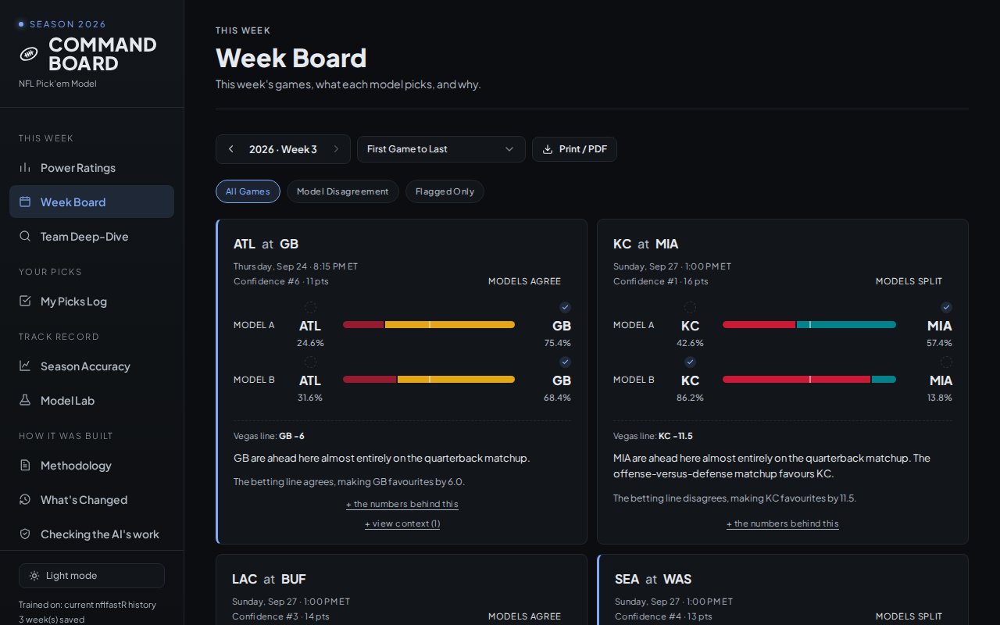
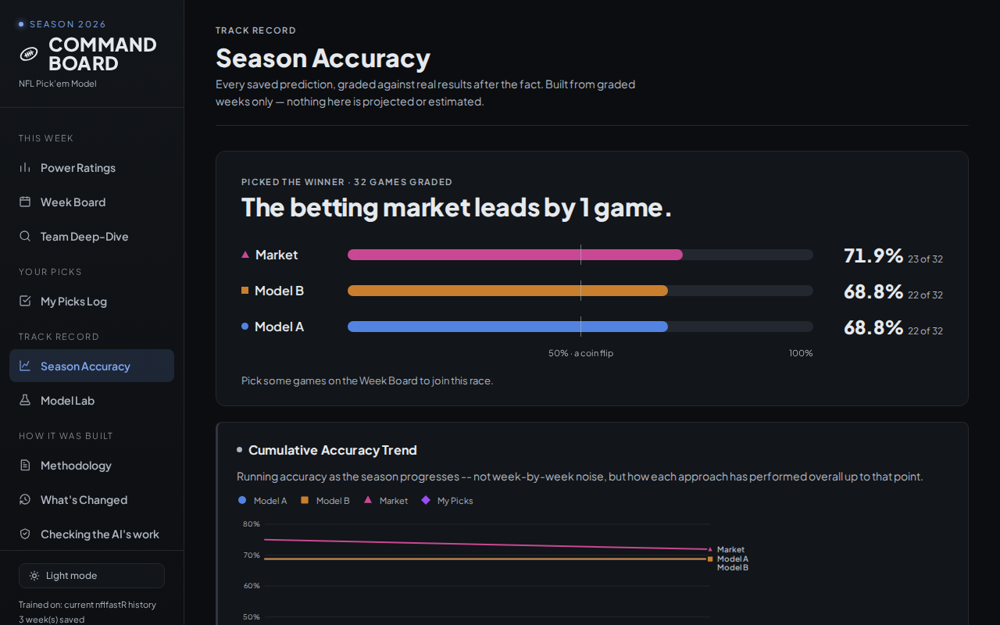
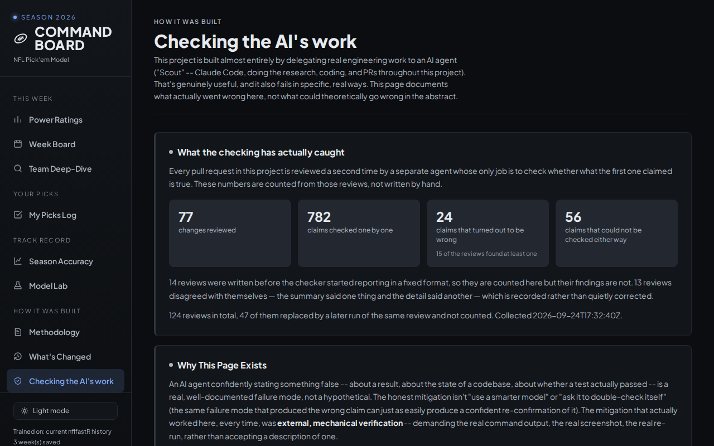

# NFL Pick'em Model

A real, backtested win-probability model for weekly NFL picks. Not a
heuristic -- trained and validated on nflverse play-by-play for 2020-2025,
with backtest numbers that were actually run.

**Live dashboard: https://lifeisgreat07.github.io/NFL-Model-2/**



*Screenshots in this README were taken on 2026-09-24. Team logos load from
a CDN the rendering machine could not reach, so they are missing from the
images; the live page shows them.*

## For recruiters -- project overview

This is a working prediction system, not a notebook. Every week it pulls
fresh play-by-play data, refits opponent-adjusted team ratings, writes
that week's picks to a timestamped file **before kickoff**, and grades
them against reality afterwards. The dashboard above is generated from
those files, so the accuracy record on it is the model's real record, not
a number typed in by hand.

What it is meant to demonstrate, and where to look:

- **A model that beats its baselines and admits where it doesn't.** The
  table below is a 2022-2025 holdout, 1,087 games, never trained on the
  season it is evaluated against. The football-only model beats
  home-team-always-wins by about 8 points. It does *not* beat the betting
  market, and the README says so rather than quietly omitting the
  comparison. See `src/backtest.py` and `src/ratings_engine.py`.
- **Leak-free by construction, and tested for it.** Every rating a
  prediction uses is computed from data available before that game
  kicked off. `tests/test_leak_free.py` fails the build if a future
  observation ever reaches a past prediction.
- **Tuned constants with the experiment attached.** `src/config.py`
  carries every hyperparameter next to the backtest that justified it,
  so no number in the model is there because it looked about right.
- **AI-assisted development with an independent verifier.** Work is done
  in a "Scout" role and audited by a separate "Booth" role that shares no
  context with it, runs in CI on every pull request, and must re-execute
  the commands that would prove or disprove each claim before it reports.
  See `BOOTH_PROTOCOL.md`, `.github/workflows/booth-pr-audit.yml`, and
  `VERIFICATION.md` -- the last of which is the rule that no claim in this
  repository is made without evidence that was actually run.
- **Tests that are themselves tested.** A committed mutation corpus
  (`tests/mutation/`, 63 case files, one per subject under test)
  deliberately breaks the code in known
  ways and fails if the suite does not catch the break -- because a test
  that passes against broken code is worse than no test.
- **Nine CI workflows** in `.github/workflows/` cover the test suite, the
  weekly data pull, the backtest, the Pages build-and-deploy, the
  agent-activity log, a pre-flight check on every pull request description,
  both halves of the Booth audit, and an issue raised when a Booth audit
  fails.

- **Case studies of what went wrong, and a list of what it taught.** Four
  write-ups in `docs/case-studies/`, each a real problem, how it was found
  and what it cost, with every figure held to its source by a test. The
  lessons across all of them are in `docs/lessons-learned.md`.

If you have five minutes: open the live dashboard, read its **Methodology**
page, then read `VERIFICATION.md`. Those three cover what the model does,
how it was validated, and how the work on it is checked. For how the pieces
fit together, `docs/architecture.md` has the whole system on one diagram.

## Current model (v2.5)
- Opponent-adjusted team ratings: two-way fixed-effects ridge regression
  on play-level EPA, recency-weighted (16-game half-life), alpha=15
  (tuned via backtest -- see `src/config.py` for justification of every
  constant).
- Per-QB rating: leak-free trailing EPA/dropback, shrunk toward league
  average for small samples. Live picks use the quarterback expected to
  start: a sourced override if one has been filed, otherwise the
  schedule's listed starter, otherwise last game's quarterback with a
  note. The backtest uses each game's actual starter.
- Four features, each a difference between the two teams: offence,
  defence, quarterback, and a term for a change of quarterback, fed to a
  logistic regression refit every week. The model outputs a win probability, never a margin.
- Two models shown side by side: **Model A** (football-only) and
  **Model B** (Model A plus the current betting spread).

Backtest results (2022-2025 holdout, 1,087 games, refit every week on
strictly earlier games, never trained on the season being evaluated). The
same table is on the dashboard's **Methodology** page, and
`tests/test_readme_accuracy.py` fails if the two disagree:

| Model | Accuracy | Log Loss | Brier | AUC |
|---|---|---|---|---|
| Coin flip | 50.0% | 0.693 | 0.250 | 0.500 |
| Home team always wins | 54.6% | - | - | - |
| Model A (football only) | 62.8% | 0.650 | 0.229 | 0.670 |
| Vegas market alone | 68.2% | 0.607 | 0.210 | 0.725 |
| Model B (+ market) | 68.2% | 0.606 | 0.209 | 0.727 |

This season's live record, graded after each week, is on the dashboard's
Season Accuracy page:



Judge the backtest on log loss, Brier and AUC. The same code and data can differ
by a game or two out of 1,087 between machines, so accuracy alone can't
separate models this close; Model B and the market are statistically tied.

The full methodology write-up lives on the dashboard's **Methodology**
page rather than in a separate file, so that the explanation and the
numbers it explains are regenerated from the same data in the same step.

## How the work is checked

Most of this repository was written by an AI agent, and the setup around
it assumes the agent will sometimes be confidently wrong.

- **Scout** does the work and opens every pull request.
  `src/scout_preflight.py` checks the description against the repository
  before anyone reads it: suite counts, whether every commit is
  mentioned, figures quoted from a wider command than the sentence claims.
- **Booth** is a second agent that starts cold on every pull request,
  re-executes each claim in the description, and posts a report with a
  machine-readable verdict. It has read-only access and cannot merge.
  The workflow fails if Booth posts nothing (`src/booth_report_posted.py`).
- **The test suite** includes guards on the project's own documentation:
  numbers quoted in prose are tied to the files they came from, and the
  mutation corpus proves each guard fails when the thing it protects
  breaks.
- **Every audit is public.** The dashboard's "Checking the AI's work" page
  counts Booth's reports live from `data/agent_log.json`, and links the
  case studies.



## Repo layout
```
docs/
  architecture.md       -- the whole system on one diagram
  case-studies/         -- write-ups of real problems and how they were found
  lessons-learned.md    -- what it all taught, each lesson with its source
src/
  config.py             -- every tuned constant, with the backtest that justified it
  data_loader.py        -- pulls fresh nflverse data automatically (no manual CSVs)
  ratings_engine.py     -- team + QB rating computation (leak-free, recency-weighted)
  weekly_update.py      -- main entrypoint: generates next week's predictions
  grade_predictions.py  -- grades a completed week against actual results
  backtest.py           -- the holdout backtest behind the table above
  calibration.py        -- reliability of the stated probabilities
  generate_dashboard.py -- builds index.html from the template plus data/
  dashboard_template.html -- the dashboard's markup, with data injected at build
  scout_preflight.py    -- checks a branch against the project's own rules
  session_wrapup.py     -- end-of-session checks (suite count, unpushed work, docs)
predictions/            -- one JSON file per week, saved BEFORE kickoff, never edited
results/                -- graded predictions, builds the season accuracy record
data/                   -- generated inputs the dashboard reads
tests/                  -- the suite, plus tests/mutation/ (tests for the tests)
.github/workflows/      -- CI: tests, weekly update, backtest, dashboard, Booth
```

`index.html` and `dist/` are **build outputs and are not in the repository.**
Both are produced by `src/generate_dashboard.py`; GitHub Pages publishes them
from a CI build, and the test suite builds them itself via the root
`conftest.py`. To see the dashboard locally, run the generator.

## Manual usage
```bash
pip install -r requirements.txt
python src/weekly_update.py --season 2026 --week 2
# ... after that week's games finish ...
python src/grade_predictions.py --season 2026 --week 2
# rebuild the dashboard from whatever is in data/ and results/
python src/generate_dashboard.py
```

Running the tests:
```bash
pip install -r requirements-dev.txt
python -m pytest
```

## Automating this with Claude Code Routines

The weekly pipeline itself needs no Claude at all. The repository's
**Weekly update** workflow (`.github/workflows/weekly-update.yml`) runs on
GitHub every Tuesday 11:00 UTC and Thursday 16:00 UTC. It grades finished
weeks, refreshes the ratings, playoff odds and line archive, and locks the
next week's picks at the right run: Thursday usually, and Tuesday for a
week with an earlier game (Thanksgiving, a Wednesday game). See
`decide_lock` in `src/weekly_update.py`. Its data commit then triggers the
site rebuild.

What a routine adds is the one thing a script can't do: read the news.
Picks use the starter listed on nflverse's schedule, and that list can lag
the news. On 2026-09-22 it still listed two starters who had already been
ruled out. A sourced override in `data/qb_overrides/<season>_week<N>.json`
takes precedence over it.

Setup (verified against current Claude Code docs,
code.claude.com/docs/en/routines):

1. **Push this repo to GitHub.** Routines clone from GitHub on every run.
2. **Connect GitHub to Claude Code**, if you haven't already: run
   `/web-setup` inside Claude Code (this is separate from installing the
   GitHub App -- both are required for the routine to actually trigger).
3. **Create the routine** on the web at `claude.ai/code/routines` -> New
   routine, or with `/schedule` in the Claude Code CLI.
4. **Schedule it Monday and Wednesday evening** (`0 22 * * 1,3`, UTC), so
   a PR is waiting before each scheduled lock: Wednesday's before
   Thursday's, Monday's before a Tuesday lock.
5. **Make sure the routine's cloud environment has network access
   enabled** -- it needs nflverse's GitHub-hosted data and web search for
   QB news. This is a setting on the routine's environment.
6. **Give it narrow, unattended-safe instructions.** The routine this repo
   runs, "Weekly QB override research", is told to:
   - find the next week to predict with `determine_next_week`;
   - web-search starting-QB news for every team playing that week;
   - record a team only when a credible source says the listed starter
     won't start, or names another starter;
   - write the override file as a list of
     `{"team", "player_id", "player_name", "source"}`, where `player_id`
     is the GSIS id (00-0000000) and `source` is a link, and validate it
     with `load_qb_overrides`;
   - open a PR titled "QB overrides: <season> week N", or stop with one
     line if nothing needs overriding.

   It must NOT run `src/weekly_update.py`, `src/grade_predictions.py` or
   `src/generate_dashboard.py`. The workflow owns those, and a second writer of
   saved predictions would be a second way to break a lock.
7. **Merge the override PR before the lock.** On a normal week, that means
   before Thursday 16:00 UTC. An override merged after the lock changes
   nothing, because a locked week is final.

## What this does NOT automate yet
- Confirming genuinely uncertain starting QB situations (e.g. a team
  benching its starter) -- the routine above researches them and opens a
  PR, but a person still decides whether to merge it.
- Hyperparameters (alpha, half-life, QB shrinkage) are NOT re-tuned
  automatically each week -- they're fit once via backtest and left fixed
  in `src/config.py`. Re-running the full backtest sweep weekly would be
  needlessly expensive; do it manually every few weeks or once per season.
- The model does not beat the betting market on its own. Model B only
  matches it, within noise. Treating Model A as an edge against a market
  price would be a misreading of the table above.
