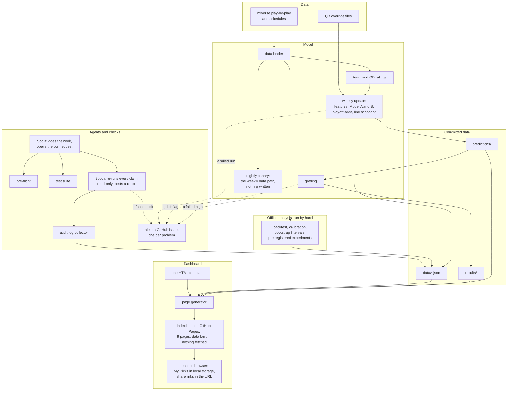

# Architecture

How the pieces fit: where the data comes from, what runs on a schedule, how
a change gets checked, and how the page is built. The diagram is the whole
system on one screen; the table under it names the file behind each box.

## What each box is

| Box | File | When it runs |
|---|---|---|
| data loader | `src/data_loader.py` | Every model run. nflreadpy, with `nfl_data_py` kept as a checked fallback. |
| team and QB ratings | `src/ratings_engine.py` | Every model run. Only data from before each game's week. |
| weekly update | `src/weekly_update.py` | `.github/workflows/weekly-update.yml`, on a schedule (Tuesday and Thursday) and by hand. Picks lock on Thursday. Each run writes a summary to its page (`src/weekly_summary.py`); a failed run goes to the alert. |
| QB override files | `src/weekly_update.py` (`load_qb_overrides`) | Read by the weekly update from a folder under data, when a sourced note says who is actually starting. None has been filed yet, so the folder does not exist in the repository. |
| grading | `src/grade_predictions.py` | Same workflow, once a week's games are played. Then `src/drift_alert.py` runs the drift check (`src/check_drift.py`); a flag opens an issue and never fails the run. |
| nightly canary | `src/canary.py`, `src/schema_check.py`, `.github/workflows/nightly-canary.yml` | 06:00 UTC every night. Loads what the weekly run loads, runs the data-quality checks, and compares nflverse's columns with `data/nflverse_schema.json`. Writes nothing; a failure goes to the alert. |
| backtest, calibration, bootstrap, experiments | `src/backtest.py`, `src/calibration.py`, `src/bootstrap_brier_gap.py`, `src/stage5_run.py` | By hand, when a question needs them. Results are committed under `data/` and `experiments/`, and tests tie published numbers to them. |
| Scout | a Claude Code session | Opens every pull request. Production code goes through review; documentation can go straight to `main`. |
| pre-flight | `src/scout_preflight.py`, `.github/workflows/scout-preflight.yml` | Every pull request. Checks the description against the repository. |
| test suite | `tests/`, `.github/workflows/run-tests.yml` | Every pull request. Includes a committed mutation corpus in `tests/mutation/`. |
| Booth | `.github/workflows/booth-pr-audit.yml`, `BOOTH_PROTOCOL.md` | Every pull request, and again when its description is edited. Read-only; fails the run if no report was posted (`src/booth_report_posted.py`). |
| audit log collector | `src/collect_agent_log.py`, `.github/workflows/collect-agent-log.yml` | Every push to `main`. Writes `data/agent_log.json`, which the dashboard counts live. |
| alert | `src/alerts.py`, `src/booth_alert.py`, `.github/workflows/booth-alert.yml` | After every Booth audit run, from the nightly canary, and from the weekly run. A failed or timed-out audit, a failed night, a drift flag or a failed weekly run opens an issue, or comments on the one already open. |
| page generator | `src/generate_dashboard.py`, checked by `src/check_build.py` | `.github/workflows/deploy-pages.yml`, when the inputs change or another workflow commits data. The build is refused if any page's data payload is missing or empty. |
| one HTML template | `src/dashboard_template.html` | Vanilla JavaScript, no framework, no build step. |

## Decisions the diagram rests on

- **The dashboard is one static file.** Every page's data is written into the
  HTML when it is built, and the page makes no network requests for data.
  That is why it can run on GitHub Pages from a scheduled job, and why a
  stranger reading the repository sees no runtime dependencies.
- **Booth can't write.** Its job runs with read-only repository access, so it
  can report but never change what it audits. Merging stays a human
  decision.
- **Generated files aren't committed.** `index.html` is built by the deploy
  workflow, not checked in, so branches that touch the template don't
  collide with builds on `main`.
- **A commit made by one workflow can't trigger another on its own.** The
  deploy workflow therefore listens for the workflows that commit data, as
  well as for pushes. That handoff was broken once, and a test now checks
  that every workflow writing dashboard inputs is listed.
