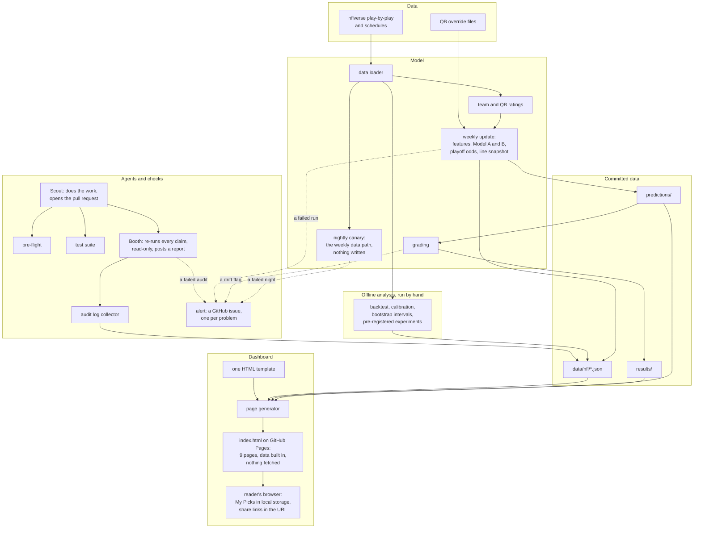

# Architecture

How the pieces fit: where the data comes from, what runs on a schedule, how
a change gets checked, and how the page is built. The diagram is the whole
system on one screen; the table under it names the file behind each box.

```mermaid
flowchart TB
  subgraph DATA["Data"]
    NFL["nflverse play-by-play<br/>and schedules"]
    OVR["QB override files"]
  end

  subgraph MODEL["Model"]
    LOAD["data loader"]
    RATE["team and QB ratings"]
    WEEK["weekly update:<br/>features, Model A and B,<br/>playoff odds, line snapshot"]
    GRADE["grading"]
    CANARY["nightly canary:<br/>the weekly data path,<br/>nothing written"]
  end

  subgraph STORE["Committed data"]
    PRED["predictions/"]
    RES["results/"]
    DJ["data/nfl/*.json"]
  end

  subgraph ANALYSIS["Offline analysis, run by hand"]
    BT["backtest, calibration,<br/>bootstrap intervals,<br/>pre-registered experiments"]
  end

  subgraph AGENTS["Agents and checks"]
    SCOUT["Scout: does the work,<br/>opens the pull request"]
    PRE["pre-flight"]
    TESTS["test suite"]
    BOOTH["Booth: re-runs every claim,<br/>read-only, posts a report"]
    LOG["audit log collector"]
    ALERT["alert: a GitHub issue,<br/>one per problem"]
  end

  subgraph UI["Dashboard"]
    GEN["page generator"]
    TPL["one HTML template"]
    PAGE["index.html on GitHub Pages:<br/>9 pages, data built in,<br/>nothing fetched"]
    BROWSER["reader's browser:<br/>My Picks in local storage,<br/>share links in the URL"]
  end

  NFL --> LOAD --> RATE --> WEEK
  OVR --> WEEK
  LOAD --> CANARY
  CANARY -. a failed night .-> ALERT
  GRADE -. a drift flag .-> ALERT
  WEEK -. a failed run .-> ALERT
  WEEK --> PRED
  WEEK --> DJ
  PRED --> GRADE --> RES
  LOAD --> BT --> DJ

  SCOUT --> PRE
  SCOUT --> TESTS
  SCOUT --> BOOTH
  BOOTH --> LOG --> DJ
  BOOTH -. a failed audit .-> ALERT

  PRED --> GEN
  RES --> GEN
  DJ --> GEN
  TPL --> GEN --> PAGE --> BROWSER
```

## What each box is

| Box | File | When it runs |
|---|---|---|
| data loader | `src/sports/nfl/data_loader.py` | Every model run. nflreadpy, with `nfl_data_py` kept as a checked fallback. Finished seasons of play-by-play can be cached on disk (`NFL_PBP_CACHE`); only the nightly canary does, and the weekly run always fetches fresh. |
| team and QB ratings | `src/sports/nfl/ratings_engine.py` | Every model run. Only data from before each game's week. |
| weekly update | `src/sports/nfl/weekly_update.py` | `.github/workflows/nfl-weekly-update.yml`, on a schedule (Tuesday and Thursday) and by hand. Picks lock on Thursday. Each run writes a summary to its page (`src/sports/nfl/weekly_summary.py`); a failed run goes to the alert. |
| QB override files | `src/sports/nfl/weekly_update.py` (`load_qb_overrides`) | Read by the weekly update from a folder under data, when a sourced note says who is actually starting. None has been filed yet, so the folder does not exist in the repository. |
| grading | `src/sports/nfl/grade_predictions.py` | Same workflow, once a week's games are played. Then `src/sports/nfl/drift_alert.py` runs the drift check (`src/sports/nfl/check_drift.py`); a flag opens an issue and never fails the run. |
| weekend refresh | `src/sports/nfl/weekend_refresh.py`, `.github/workflows/nfl-weekend-refresh.yml` | Friday, Sunday evening and Monday morning, between the Thursday lock and Tuesday's grading. Writes game status, final scores and the latest line for each locked, not yet fully graded week to a folder under data that its first run creates, and appends the same weeks' spreads to `data/nfl/line_history/` (Stage 33 item 23), so the line archive runs past the lock to the close. Commits those folders and the TV and team-news files only, so it cannot touch a pick or a grade; a failure goes to the alert. |
| TV channels | `src/sports/nfl/tv_channels.py`, `data/nfl/tv/exceptions.json` | Run with `--pending` by the weekly update (after Tuesday's grading and Thursday's lock) and by the weekend refresh, for every locked week not yet graded, as a continue-on-error step in both, so it can never cost a pick (Stage 15). Reads the league's by-week schedule page and shows a game's network only after an exact id join to nflverse, a team and kickoff cross-check, a closed network list and a slot rule with sourced exceptions; one network per game, the first listed; every shown channel carries where and when it was read, and a change between reads is recorded. Writes one file per week beside the exceptions. A held-back channel is a warning, never an error. |
| team news | `src/sports/nfl/team_news.py` | Run with `--pending` by the weekly update (after Tuesday's grading and Thursday's lock) and by the weekend refresh, as a continue-on-error step in both, so it can never cost a pick (Stage 16). For each locked week not yet graded: starters (rank 1 on the latest depth chart, plus kicker and punter) listed Out or Doubtful on the injury report, by name; starters listed Questionable, as a count; and the quarterback the saved pick was made with, flagged when he is not last game's starter. A week whose report is not out yet says so rather than listing nobody. Writes one file per week to a folder under data that its first run creates, and does not rewrite a week whose news is unchanged. |
| Model Lab records | `src/sports/nfl/model_lab.py`, `experiments/nfl/legacy/rows.json` | Read by the page generator, which renders Model Lab's table from it at build time (`render_model_lab_rows`), so the table is in the page without JavaScript (Stage 18). One list of every experiment: each pre-registered answer in the experiments folders' results, each registered question deferred on purpose, and the 46 rows the page carried before Stage 18, moved into `experiments/nfl/legacy/rows.json` once and verbatim. Every entry carries one of the five decisions beside the label it was first given, and a leakage flag; every figure is copied from its file. |
| nightly canary | `src/sports/nfl/canary.py`, `src/sports/nfl/schema_check.py`, `.github/workflows/nfl-nightly-canary.yml` | 06:00 UTC every night. Loads what the weekly run loads, runs the data-quality checks, and compares nflverse's columns with `data/nfl/nflverse_schema.json`. Then checks the shape of next week's nfl.com schedule page, the TV-channel source: a page with no games, or a game missing its id or teams or from another week, is an error; a game missing its kickoff or network is a warning. Writes nothing; a failure goes to the alert. |
| nightly mutation slice | `tests/mutation/runner.py`, `.github/workflows/nightly-mutation.yml` | 06:30 UTC every night. Runs 30 mutation cases chosen by the date, so guards are broken on purpose again, not only the ones a PR touched: with over 1,600 cases, a given one comes up about once a month on average (each night's draw is independent, so some wait much longer). The counts go in the run summary; any case not caught by the test it names fails the run. Writes nothing. |
| nightly dependency audit | `.github/workflows/nightly-dependency-audit.yml` | 07:45 UTC every night. pip-audit (installed in this job only, pinned) checks `requirements.txt` and what it pulls in against the known-vulnerability databases. Report-only: it changes no pin and fails no pull request. A finding opens the issue "Dependency audit found known vulnerabilities"; an audit that could not run opens "Dependency audit could not run". Writes nothing. |
| nightly shuffled suite | `.github/workflows/nightly-random-order.yml` | 07:15 UTC every night. Runs the whole suite in a random order across all files (pytest-random-order, installed in this job only), seeded by the date, so a test that passes only because of what ran before it is found. A failure opens the issue "Nightly shuffled suite failing" with the replay command. Writes nothing. |
| backtest, calibration, bootstrap, experiments | `src/sports/nfl/research/backtest.py`, `src/sports/nfl/research/calibration.py`, `src/sports/nfl/research/bootstrap_brier_gap.py`, `src/sports/nfl/research/stage5_run.py` | By hand, when a question needs them. Results are committed under `data/` and `experiments/`, and tests tie published numbers to them. `src/sports/nfl/research/reproducibility_audit.py` re-runs the published backtest twice and compares it with `data/nfl/calibration.json`; its last run is `data/nfl/reproducibility_audit.json`. |
| Scout | a Claude Code session | Opens every pull request. Production code goes through review; documentation can go straight to `main`. |
| pre-flight | `src/agents/scout_preflight.py`, `.github/workflows/scout-preflight.yml` | Every pull request. Checks the description against the repository. |
| test suite | `tests/`, `.github/workflows/run-tests.yml` | Every pull request. Includes a committed mutation corpus in `tests/mutation/`. |
| Booth | `.github/workflows/booth-pr-audit.yml`, `BOOTH_PROTOCOL.md` | Every pull request, and again when its description is edited. Read-only; fails the run if no report was posted, or if the report's verdict block disagrees with its own prose (`src/agents/booth_report_posted.py`). |
| audit log collector | `src/agents/collect_agent_log.py`, `.github/workflows/collect-agent-log.yml` | Each pull request merged into `main`, and manual dispatch. Writes `data/agent_log.json`, which the dashboard counts live. |
| releases | `src/agents/release_notes.py`, `.github/workflows/releases.yml` | By hand, or when a `v*` tag is pushed (a tag with no history entry fails the run). Creates a GitHub Release for each tagged model version that has none, with its notes taken from the version history; a version that already has a release is skipped. Writes nothing to the repository. |
| alert | `src/core/alerts.py` (every sport's), `src/agents/booth_alert.py`, `.github/workflows/booth-alert.yml` | After every Booth audit run, from the nightly canaries, from the weekly run, from the weekend refresh and from the NHL's and NBA's daily runs. A failed or timed-out audit, a failed night, a drift flag, a failed weekly run or a failed refresh opens an issue, or comments on the one already open. |
| browser checks | `tests/browser/check_page.py`, `.github/workflows/browser-checks.yml` | Every pull request that touches what the page is built from, and pushes to `main`. Builds the page and drives Chromium over every page at six widths, with the network blocked and allowed: sideways overflow, a Tab stop nobody can see, a control under 24px, a serious or critical axe-core finding, the font not rendering, a page error, the byte budget. Runs `--self-test` first, so a rule that cannot fail fails the job. |
| NHL data probe | `src/sports/nhl/data_probe.py`, `.github/workflows/nhl-data-probe.yml` | Pull requests that touch it, and by hand. Reads every source the NHL's go/no-go relies on from a GitHub runner (the league's schedule, play-by-play, box score and live odds; ESPN's odds for a past game; the SportsDataverse fallback; Daily Faceoff's starting goalies) and fails unless each answers in the shape a later stage needs. Writes nothing (Stage 51, `docs/nhl-data.md`). |
| NBA data probe | `src/sports/nba/data_probe.py`, `.github/workflows/nba-data-probe.yml` | Pull requests that touch it, and by hand. Reads from a GitHub runner what the NBA's live run will need (SportsDataverse's hoopR schedule, team box and player box files), and fails unless each is a parquet file. Also reports, without failing, whether ESPN and the league's `cdn.nba.com` answer a runner. Writes nothing (Stage 61, `docs/nba-data.md`). |
| NBA schedule loader | `src/sports/nba/schedule.py` | The NBA's daily run and canary (Stage 65). Reads a season from ESPN's scoreboard along the season's own calendar and returns it in the core's schedule shape: regular-season, play-in and playoff games, with All-Star and preseason games left out and the NBA Cup final kept as a neutral-site regular-season game. A game whose teams are still `TBD` is left out until they are known. Stops with every problem named on a status, competition type or field it does not recognise. Caches a finished past season only, and only when `NBA_CACHE` is set (Stage 61). |
| NBA history | `src/sports/nba/history.py` | By hand, on the local machine (ESPN refuses GitHub's runners). Reads each season's final games from ESPN's box scores (team figures, possessions, every player's minutes) and ESPN's moneyline (the closing price where given; never a live provider's, never a price of 0), and writes the NBA's history files, which the backtest's branch commits. A game whose ESPN box score is empty is read from SportsDataverse's hoopR `team_box` and `player_box` and marked so; one neither has is named in `skipped_<season>.csv`. Before a season is written, points and field-goal attempts must agree with hoopR on 99% of the games read from ESPN (Stage 61). |
| NBA model and backtest | `src/sports/nba/ratings.py`, `src/sports/nba/backtest.py` | By hand. Carries out `experiments/nba/stage61/registry.json` on `data/nba/history/`: Model A from point, efficiency and availability matchups (a recency-weighted ridge rating of point margin and of margin per 100 possessions, and the share of a team's expected minutes that play), tuned on 2022-23 and 2023-24, then H1 to H3 decided on 2024-25 and 2025-26 with a day-block bootstrap. It writes `experiments/nba/stage61/results/`. Every feature and refit uses only games from earlier days. |
| NBA backtest re-run | `src/core/compare_results.py`, `.github/workflows/nba-run-backtest.yml` | By hand. Re-runs the registered backtest from the committed data and fails when the results differ from the committed ones beyond float noise (a relative 1e-9); commits nothing (Stage 68 item 28). |
| NBA pages | `src/sports/nba/site.py`, `src/sports/nba/pages/` | The deploy, through the site build (Stage 53), published at nba/; by hand; and by the browser checks. Leads with the day board (Stage 65, the NHL's Stages 63 and 64): a strip of the week's days, compact rows and a tap to the full card, which names the price's source or says "no price", and who was listed Out. Builds one self-contained page from the NBA's own files only: the board from the saved picks and what the daily run writes (absent before its first run, which the board says), the registered questions and their answers, the scores and the tuning grid, the methods with each season's games and prices, and how the backtest was checked. Every answer and figure is read from the results files when the page is built. A missing backtest results file stops the build. Shares the NFL board's stylesheet, as the NHL's pages do. |
| NHL schedule loader | `src/sports/nhl/schedule.py` | The NHL's canary and daily run (Stages 55 and 58). Reads a season from the league's feed club by club and returns it in the core's schedule shape, with statuses mapped to the core's (a postponed, suspended or cancelled game says so whatever its game state reads) and overtime and shootout results counted. Stops with every problem named on anything it does not recognise, or on a game only one of its clubs lists. Caches a finished past season only, and only when `NHL_CACHE` is set. |
| NHL market and goalies | `src/sports/nhl/market.py`, `src/sports/nhl/goalies.py`, `src/sports/nhl/teams.py` | The NHL's daily run (Stage 58). The market reads the two-way moneyline from the league's odds feed and takes the margin out; the goalies come from Daily Faceoff's page before the game (names, label and report link only) and from the league's box score after it. Each history adds a row only when the price, goalie or label changes, never once the game has started, and every row says where and when it was read. A club or label they do not know stops the read with its name. |
| NHL injuries | `src/sports/nhl/injuries.py` | The daily run reads SportsDataverse's `espn_nhl_injuries` file (ESPN's list, one file per season named by the year it ends) when it saves picks, and stores each club's players and their status in the pick with the source, the day the list is as of and when it was read. Context only: no model reads it, and a failed read stores none without stopping the pick. A club the names do not match stops the read with its name. |
| NHL lock rule | `src/sports/nhl/lock.py` | The NHL's daily run (Stage 58). Decides for each run which NHL games to save now: each game is saved by the last run before its own start (runs at 14:00 and 21:00 UTC, with an hour's slack for a late run), a started game is never predicted, and a postponed, suspended or cancelled game is neither saved nor held. |
| NHL history and backtest | `src/sports/nhl/history.py`, `src/sports/nhl/ratings.py`, `src/sports/nhl/backtest.py` | By hand. `history.py` reads each season's box scores (shots on goal, starting goalies) from the league, checks shots on goal against SportsDataverse's `team_box` (99% must agree), and reads ESPN's moneyline from 2020-21, converting the three-way line before 2024-25. It writes `data/nhl/history/`. `backtest.py` carries out `experiments/nhl/stage56/registry.json`: it tunes Model A on 2022-23 and 2023-24, then decides H1 to H3 on 2024-25 and 2025-26 with a day-block bootstrap. It writes `experiments/nhl/stage56/results/`. Every feature and every refit uses only games from earlier days. |
| NHL backtest re-run | `src/core/compare_results.py`, `.github/workflows/nhl-run-backtest.yml` | By hand. Re-runs the registered backtest from the committed data and fails when the results differ from the committed ones beyond float noise (a relative 1e-9); commits nothing (Stage 68 item 28). |
| NHL daily run | `src/sports/nhl/daily.py`, `src/sports/nhl/roster.py`, `src/sports/nhl/drift.py`, `.github/workflows/nhl-daily.yml` | 14:00 and 21:00 UTC, and by hand. Adds this season's finished box scores to the history (a box score not settled yet is retried next run), asks the lock rule which games to save, reads each game's projected goalies (matched to the league's player ids through the clubs' rosters, else the last starter with a note) and its market price, and saves Model A's and Model B's probabilities once per game in `predictions/nhl/<season>/`, never rewritten. Grades final games (a cancelled one never counts) and runs the registered drift check (`experiments/nhl/stage58/registry.json`, `data/nhl/drift_baseline.json`). Commits only the NHL's own folders; a failure or a drift flag opens an "NHL: ..." issue. |
| NHL standings odds | `src/sports/nhl/standings.py` | In each NHL daily run that saves picks. Plays the rest of the regular season out 10,000 times from Model A with today's ratings and no goalies: two points a win, one for a loss past regulation, the top three of each division and two wild cards per conference, ties broken by regulation wins, then regulation and overtime wins, then lots. Writes `results/nhl/standings_<season>.json` for the NHL's pages (Stage 57). |
| NHL page inputs | `src/sports/nhl/page_inputs.py` | In every NHL daily run. Writes `results/nhl/schedule_<season>.json` (every game as the league lists it now) and `results/nhl/ratings_<season>.json` (each club's goal and shot ratings and each recent goalie's rating, as they stand before today, a goalie named where a saved pick named him) for the NHL's pages (Stage 57). Neither is graded; both are rewritten each run. |
| NHL pages | `src/sports/nhl/site.py`, `src/sports/nhl/pages/` | The deploy, through the site build (Stage 53), published at nhl/, including after each NHL daily run; and by hand. Builds one self-contained page from the NHL's own files only: the week's games grouped by day with each saved pick (Model B, the market and Model A, the goalies and their status), the standings odds, the ratings, the graded picks with their calibration, a page per club, the registered backtest, the drift check and What's Changed. A missing schedule stops the build; any other missing file shows as not written yet. Shares the NFL board's stylesheet until Stage 53 moves it to the shared shell; its own CSS and storage key carry the sport. |
| NHL nightly canary | `src/sports/nhl/canary.py`, `.github/workflows/nhl-canary.yml` | 06:40 UTC, and by hand. Runs every read the daily run makes (schedule, lock, a box score, the odds feed, Daily Faceoff, a roster), writes nothing, and exits 1 naming every step that failed, which opens "NHL: nightly canary failing". |
| NBA daily run | `src/sports/nba/daily.py`, `src/sports/nba/lock.py`, `src/sports/nba/market.py`, `src/sports/nba/injuries.py`, `src/sports/nba/drift.py`, `.github/workflows/nba-daily.yml` | 16:00 and 21:30 UTC, and by hand (Stage 65, from opening night 2026-10-20). Adds this season's final box scores, asks the lock rule which games to save, prices each by the registered order (ESPN's pre-game moneyline, then Kalshi's game market only for a game ESPN did not price, else "no price"), reads ESPN's injury report for the availability term (unreadable: both models without it, said in the pick), and saves Model A's and Model B's probabilities once per game in `predictions/nba/<season>/`, never rewritten. Grades final games and runs the registered drift check (`experiments/nba/stage65/registry.json`, `data/nba/drift_baseline.json`). Commits only the NBA's own folders; a failure or a drift flag opens an "NBA: ..." issue. |
| NBA nightly canary | `src/sports/nba/canary.py`, `.github/workflows/nba-canary.yml` | 06:50 UTC, and by hand. Reads each source the daily run reads on its own (ESPN's scoreboard, box score, odds and injury report, and Kalshi), writes nothing, and opens one issue per failing source, "NBA: <source> failing in the nightly canary". |
| nfl.com schedule probe | `src/sports/nfl/nfl_schedule_probe.py`, `.github/workflows/nfl-schedule-probe.yml` | Pull requests that touch it, and by hand. Reads the league's by-week schedule pages for weeks 1-4 of 2026 from a GitHub runner and fails unless every week is reachable and every game has an elias id, a kickoff, two teams, a territory, a network and the week asked for. Writes nothing (Stage 15, before any TV-channel code; ESPN refused the runners). |
| site build | `src/site/build.py`, `src/site/alert_failed.py` | `.github/workflows/deploy-pages.yml`, and `python tasks.py build`. Builds every sport's page in a process of its own into `_site/<sport>/`, the NFL's printable picks into nfl/dist/, the shared files, and the home page at the root (below), which sends any `#picks=` link on to nfl/. A sport whose build fails keeps the page that is live now and gets its own issue ("NHL: page build failed"); a home page that fails leaves the root forwarding to nfl/; nothing is published only when the NFL has no page at all. |
| home page | `src/site/home.py`, `src/site/home/` | The site build, after every sport (Stage 59; option A of the rendered "Pick'em Home Options"). A card per sport, built from that sport's own files: the NFL's latest locked week, its kickoffs and Model B's record; the NHL's games for two weeks and its picks' record; the NBA's the same way as the NHL's, from opening night (before the daily run's first schedule, when its picks start). The status ("Week 5 locked", "9 games tonight") is worked out in the visitor's browser against their clock. A sport with no page in the build gets a card that links nowhere. Checked by the browser checks. |
| page generator | `src/sports/nfl/generate_dashboard.py`, checked by `src/sports/nfl/check_build.py` | The site build (above), when the inputs change or another workflow commits data; it writes `index.html` at the repository root, which the site build copies to nfl/. The build is refused if any page's data payload is missing or empty. Before it builds, `src/sports/nfl/recent_runs.py` reads the scheduled jobs' last 30 runs from GitHub into a gitignored file; a failed read leaves that section saying so. |
| one HTML template, in parts | `src/dashboard/` (`page.html` includes `styles.css`, `body.html`, `app.js`), joined by `src/core/template_parts.py` | Vanilla JavaScript, no framework. The only build step is the join, which gives back one file (Stage 33 item 26). |

## Decisions the diagram rests on

- **The dashboard is one static file.** Every page's data is written into the
  HTML when it is built, and the page makes no network requests for data.
  That is why it can run on GitHub Pages from a scheduled job, and why a
  stranger reading the repository sees no runtime dependencies.
- **Booth can't push.** Its job runs on the workflow's own token with
  read-only access to the code, so it can never change the branch it
  audits. It can comment on pull requests, which is how it reports, and the
  same permission would let it edit a PR's description; that is accepted
  and visible in the PR's edit history. Merging stays a human decision.
  (Until 2026-09-28 the Claude Code action gave it the Claude app's token,
  which can write code; `tests/test_booth_permissions.py` keeps it on the
  workflow's own.)
- **Generated files aren't committed.** `index.html` is built by the deploy
  workflow, not checked in, so branches that touch the template don't
  collide with builds on `main`.
- **A commit made by one workflow can't trigger another on its own.** The
  deploy workflow therefore listens for the workflows that commit data, as
  well as for pushes. That handoff was broken once, and a test now checks
  that every workflow writing dashboard inputs is listed.
