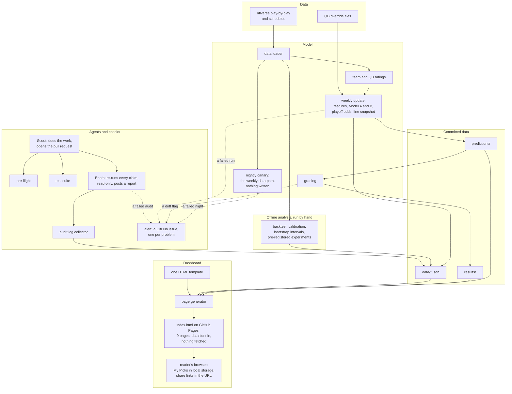

# Architecture

How the pieces fit: where the data comes from, what runs on a schedule, how
a change gets checked, and how the page is built. The diagram is the whole
system on one screen; the table under it names the file behind each box.

```mermaid
flowchart TB
  subgraph DATA["Data"]
    NFL["nflverse play-by-play<br/>and schedules"]
    OVR["QB override files"]
  end

  subgraph MODEL["Model"]
    LOAD["data loader"]
    RATE["team and QB ratings"]
    WEEK["weekly update:<br/>features, Model A and B,<br/>playoff odds, line snapshot"]
    GRADE["grading"]
    CANARY["nightly canary:<br/>the weekly data path,<br/>nothing written"]
  end

  subgraph STORE["Committed data"]
    PRED["predictions/"]
    RES["results/"]
    DJ["data/*.json"]
  end

  subgraph ANALYSIS["Offline analysis, run by hand"]
    BT["backtest, calibration,<br/>bootstrap intervals,<br/>pre-registered experiments"]
  end

  subgraph AGENTS["Agents and checks"]
    SCOUT["Scout: does the work,<br/>opens the pull request"]
    PRE["pre-flight"]
    TESTS["test suite"]
    BOOTH["Booth: re-runs every claim,<br/>read-only, posts a report"]
    LOG["audit log collector"]
    ALERT["alert: a GitHub issue,<br/>one per problem"]
  end

  subgraph UI["Dashboard"]
    GEN["page generator"]
    TPL["one HTML template"]
    PAGE["index.html on GitHub Pages:<br/>9 pages, data built in,<br/>nothing fetched"]
    BROWSER["reader's browser:<br/>My Picks in local storage,<br/>share links in the URL"]
  end

  NFL --> LOAD --> RATE --> WEEK
  OVR --> WEEK
  LOAD --> CANARY
  CANARY -. a failed night .-> ALERT
  GRADE -. a drift flag .-> ALERT
  WEEK -. a failed run .-> ALERT
  WEEK --> PRED
  WEEK --> DJ
  PRED --> GRADE --> RES
  LOAD --> BT --> DJ

  SCOUT --> PRE
  SCOUT --> TESTS
  SCOUT --> BOOTH
  BOOTH --> LOG --> DJ
  BOOTH -. a failed audit .-> ALERT

  PRED --> GEN
  RES --> GEN
  DJ --> GEN
  TPL --> GEN --> PAGE --> BROWSER
```

## What each box is

| Box | File | When it runs |
|---|---|---|
| data loader | `src/data_loader.py` | Every model run. nflreadpy, with `nfl_data_py` kept as a checked fallback. Finished seasons of play-by-play can be cached on disk (`NFL_PBP_CACHE`); only the nightly canary does, and the weekly run always fetches fresh. |
| team and QB ratings | `src/ratings_engine.py` | Every model run. Only data from before each game's week. |
| weekly update | `src/weekly_update.py` | `.github/workflows/weekly-update.yml`, on a schedule (Tuesday and Thursday) and by hand. Picks lock on Thursday. Each run writes a summary to its page (`src/weekly_summary.py`); a failed run goes to the alert. |
| QB override files | `src/weekly_update.py` (`load_qb_overrides`) | Read by the weekly update from a folder under data, when a sourced note says who is actually starting. None has been filed yet, so the folder does not exist in the repository. |
| grading | `src/grade_predictions.py` | Same workflow, once a week's games are played. Then `src/drift_alert.py` runs the drift check (`src/check_drift.py`); a flag opens an issue and never fails the run. |
| weekend refresh | `src/weekend_refresh.py`, `.github/workflows/weekend-refresh.yml` | Friday, Sunday evening and Monday morning, between the Thursday lock and Tuesday's grading. Writes game status, final scores and the latest line for each locked, not yet fully graded week to a folder under data that its first run creates. Commits that folder only, so it cannot touch a pick; a failure goes to the alert. |
| TV channels | `src/tv_channels.py`, `data/tv/exceptions.json` | Run with `--pending` by the weekly update (after Tuesday's grading and Thursday's lock) and by the weekend refresh, for every locked week not yet graded, as a continue-on-error step in both, so it can never cost a pick (Stage 15). Reads the league's by-week schedule page and shows a game's network only after an exact id join to nflverse, a team and kickoff cross-check, a closed network list and a slot rule with sourced exceptions; one network per game, the first listed; every shown channel carries where and when it was read, and a change between reads is recorded. Writes one file per week beside the exceptions. A held-back channel is a warning, never an error. |
| nightly canary | `src/canary.py`, `src/schema_check.py`, `.github/workflows/nightly-canary.yml` | 06:00 UTC every night. Loads what the weekly run loads, runs the data-quality checks, and compares nflverse's columns with `data/nflverse_schema.json`. Then checks the shape of next week's nfl.com schedule page, the TV-channel source: a page with no games, or a game missing its id or teams or from another week, is an error; a game missing its kickoff or network is a warning. Writes nothing; a failure goes to the alert. |
| backtest, calibration, bootstrap, experiments | `src/backtest.py`, `src/calibration.py`, `src/bootstrap_brier_gap.py`, `src/stage5_run.py` | By hand, when a question needs them. Results are committed under `data/` and `experiments/`, and tests tie published numbers to them. `src/reproducibility_audit.py` re-runs the published backtest twice and compares it with `data/calibration.json`; its last run is `data/reproducibility_audit.json`. |
| Scout | a Claude Code session | Opens every pull request. Production code goes through review; documentation can go straight to `main`. |
| pre-flight | `src/scout_preflight.py`, `.github/workflows/scout-preflight.yml` | Every pull request. Checks the description against the repository. |
| test suite | `tests/`, `.github/workflows/run-tests.yml` | Every pull request. Includes a committed mutation corpus in `tests/mutation/`. |
| Booth | `.github/workflows/booth-pr-audit.yml`, `BOOTH_PROTOCOL.md` | Every pull request, and again when its description is edited. Read-only; fails the run if no report was posted (`src/booth_report_posted.py`). |
| audit log collector | `src/collect_agent_log.py`, `.github/workflows/collect-agent-log.yml` | Every push to `main`. Writes `data/agent_log.json`, which the dashboard counts live. |
| alert | `src/alerts.py`, `src/booth_alert.py`, `.github/workflows/booth-alert.yml` | After every Booth audit run, from the nightly canary, from the weekly run and from the weekend refresh. A failed or timed-out audit, a failed night, a drift flag, a failed weekly run or a failed refresh opens an issue, or comments on the one already open. |
| browser checks | `tests/browser/check_page.py`, `.github/workflows/browser-checks.yml` | Every pull request that touches what the page is built from, and pushes to `main`. Builds the page and drives Chromium over every page at six widths, with the network blocked and allowed: sideways overflow, a Tab stop nobody can see, a control under 24px, a serious or critical axe-core finding, the font not rendering, a page error, the byte budget. Runs `--self-test` first, so a rule that cannot fail fails the job. |
| nfl.com schedule probe | `src/nfl_schedule_probe.py`, `.github/workflows/nfl-schedule-probe.yml` | Pull requests that touch it, and by hand. Reads the league's by-week schedule pages for weeks 1-4 of 2026 from a GitHub runner and fails unless every week is reachable and every game has an elias id, a kickoff, two teams, a territory, a network and the week asked for. Writes nothing (Stage 15, before any TV-channel code; ESPN refused the runners). |
| page generator | `src/generate_dashboard.py`, checked by `src/check_build.py` | `.github/workflows/deploy-pages.yml`, when the inputs change or another workflow commits data. The build is refused if any page's data payload is missing or empty. |
| one HTML template | `src/dashboard_template.html` | Vanilla JavaScript, no framework, no build step. |

## Decisions the diagram rests on

- **The dashboard is one static file.** Every page's data is written into the
  HTML when it is built, and the page makes no network requests for data.
  That is why it can run on GitHub Pages from a scheduled job, and why a
  stranger reading the repository sees no runtime dependencies.
- **Booth can't write.** Its job runs with read-only repository access, so it
  can report but never change what it audits. Merging stays a human
  decision.
- **Generated files aren't committed.** `index.html` is built by the deploy
  workflow, not checked in, so branches that touch the template don't
  collide with builds on `main`.
- **A commit made by one workflow can't trigger another on its own.** The
  deploy workflow therefore listens for the workflows that commit data, as
  well as for pushes. That handoff was broken once, and a test now checks
  that every workflow writing dashboard inputs is listed.
